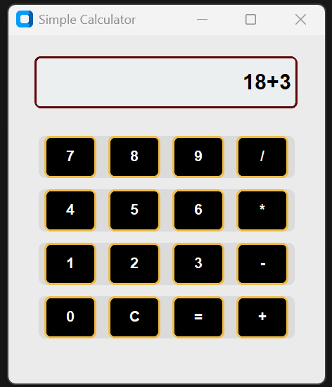
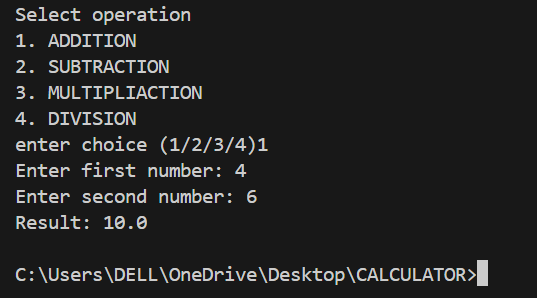

# Python Calculator 🧮

A simple calculator project in Python with both CLI and GUI versions.

## 🔧 Features

- **CLI Version** (Command Line):
  - Supports basic operations: add, subtract, multiply, divide
  - Easy to run in terminal
  - Code: [`cli_cal.py`](cli_cal.py)

- **GUI Version**:
  - Built using CustomTkinter
  - User-friendly interface
  - Light mode and dark mode support
  - Code: [`gui_cal.py`](gui_cal.py)

## 🖼️ Screenshots

### GUI Output:

### CLI Output:

🛡️ Note: Please feel free to fork the project. Pull requests are welcome, but I prefer keeping the original code as-is. Suggestions via issues are appreciated!
